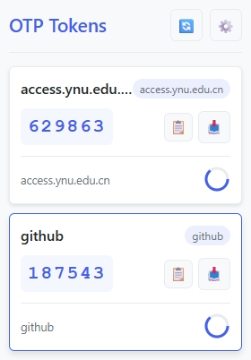
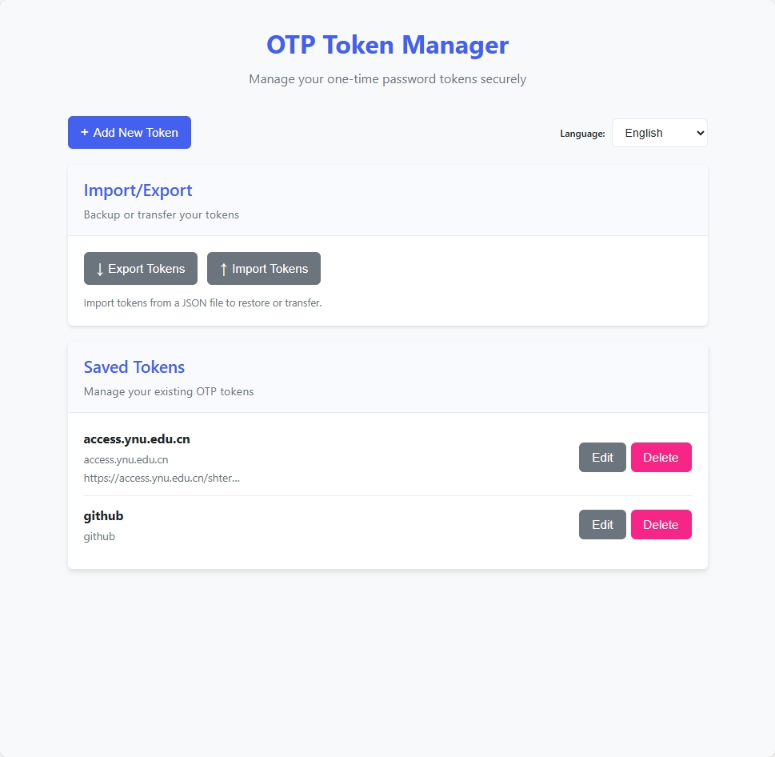
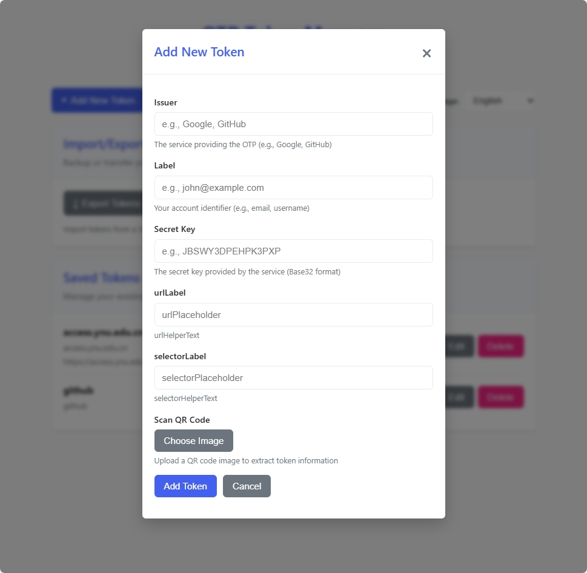

# Simple OTP Browser Extension

A browser extension for generating and managing OTP (One-Time Password) tokens. Works with Chrome, Firefox, and other Chromium-based browsers.

## Features

- Generate time-based OTP tokens (TOTP)
- Manage multiple OTP accounts with issuer, label, and secret
- Modern, responsive UI with i18n support (English and Chinese)
- Copy OTP tokens to clipboard with one click
- Visual countdown timer with warning when token is about to expire
- Import/Export functionality for backup and migration
- Scan QR codes from images to automatically populate token information
- Cross-browser compatibility

## Installation

1. Clone or download this repository
2. Install dependencies: `npm install`
3. Build the extension: `npm run build`
4. Load the extension in your browser:
   - **Chrome/Chromium**: 
     1. Open `chrome://extensions`
     2. Enable "Developer mode"
     3. Click "Load unpacked" and select the `dist` folder
   - **Firefox**:
     1. Open `about:debugging`
     2. Click "This Firefox"
     3. Click "Load Temporary Add-on" and select the `manifest.json` file in the `dist` folder

## Snapshots

## Development

- Run `npm run dev` to watch for changes and automatically rebuild
- Modify files in the root directory (not in `dist`)
- The `dist` folder is automatically generated and should not be modified directly

## GitHub Actions

This repository includes GitHub Actions for automated workflows:

### Release Workflow
- Automatically creates a release when a new tag (v*) is pushed
- Builds the extension and packages it as a ZIP file
- Creates a GitHub release with the packaged extension

### Version Bump Workflow
- Manually triggered workflow to bump the version
- Updates both `package.json` and `manifest.json`
- Creates a pull request with the version changes

## Usage

1. Click the extension icon to open the popup
2. Click "Add Token" to configure your OTP accounts
3. Enter the issuer (e.g., Google), label (e.g., your email), and secret key
4. Save the token
5. The popup will now show your OTP tokens with a visual countdown

### Add Tokens with QR Code

You can add tokens by scanning QR codes from images:

1. Open the extension options page
2. Click "Add New Token"
3. Click "Choose Image" and select a QR code image
4. The token information will be automatically extracted and filled in
5. Review and save the token

### Language Selection

The extension supports multiple languages:

1. Open the extension options page
2. Use the language selector in the top right corner
3. Choose from:
   - Auto (detects your browser language)
   - English (en-US)
   - Chinese (zh-CN)

### Import/Export Tokens

1. Open the extension options page
2. Click "Export Tokens" to save your tokens to a JSON file
3. Click "Import Tokens" to load tokens from a JSON file
   - Tokens with the same issuer and label will be replaced
   - New tokens will be added to your existing collection

## Security

- All data is stored locally in your browser
- Secrets are never transmitted over the network
- The extension has no external dependencies

## License

MIT